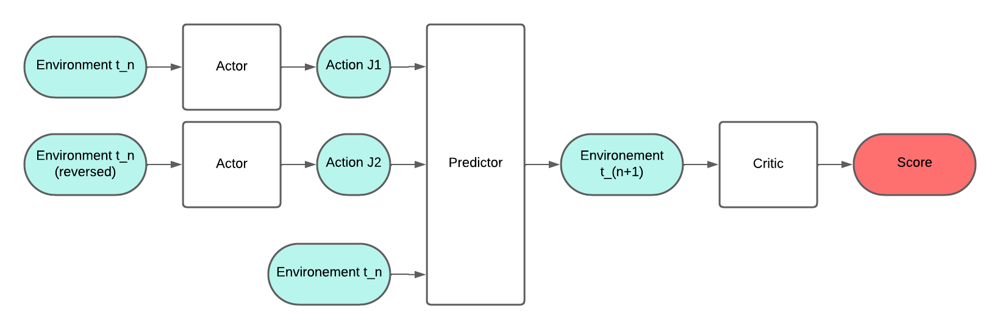

# MadPodRacing-enhanced-actor-critic
Considering the convergence problems (speed and optimality) faced during the usage of the actor critic method, I tried something else. (Not working better)

The idea is to add a  in the actor-critic model. Thid predictor bloc will be trained for a long time on random exemple of the game and random actions. While the actors and critics version can evolve, the predictor will always remain the same. 

Furthermore, it's easier to give a score to the environment at one tick rather than to the environment + action of player 1 without knowing the action of player 2. 

Also, I might to implement chess like rewards that evaluate the "position" of the game. 

Trainig : 
Predictor : random env+action. 

Critic : critic(env_n) = critic(env_n+1) 

Actor : max/min critic(predictor(env_n, action1, action2))

Critic(fin) = (distance du pod adverse au cp de fin)/100